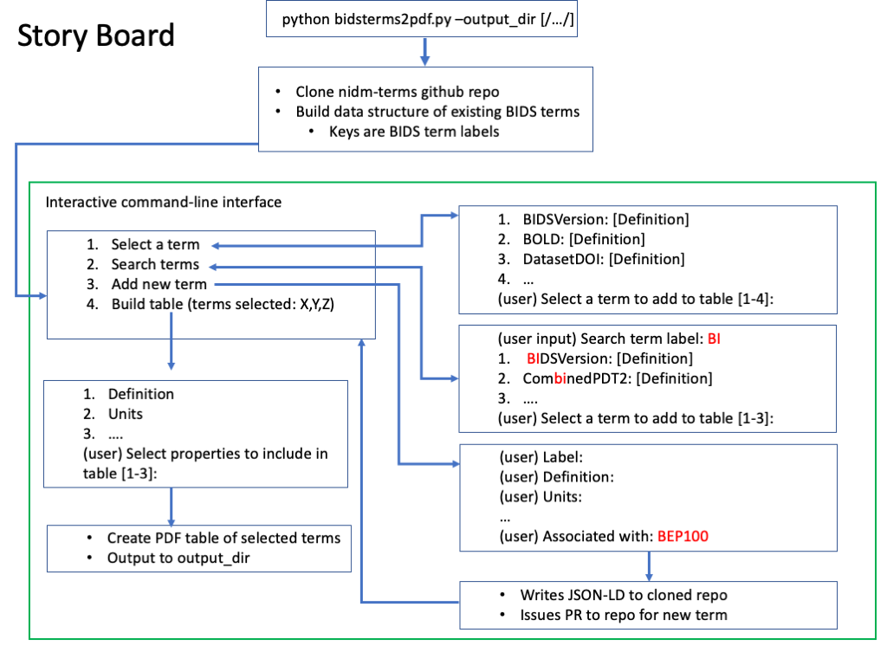

# BIDS-Terms To Markdown Table

## Project Description 

  

In this project we aim to create a user friendly python tool for creating and exporting BIDS specification terms in PDF form tables for incorporation into the BIDS specification documents. This project is a part of the effort of the [NIDM-Terms project](https://scicrunch.org/nidm-terms/about/project) allowing the the BIDS working group to select amongst our curated [BIDS terms](https://github.com/NIDM-Terms/terms/tree/master/terms/BIDS_Terms) , search our information resource “[Interlex](https://scicrunch.org/nidm-terms)” for existing BIDS terms, or add a new BIDS term, which will constantly result in term dictionary in JSON-LD form added to our family of [BIDS Specification terms](https://github.com/NIDM-Terms/terms/tree/master/terms/BIDS_Terms). The user will be able to select which [properties](https://github.com/nqueder/terms/tree/patch-2/terms) he/she would like to include in the table (e.g. description, label, comment, etc..). The user will then have a PDF table of the chosen/added terms and their properties as an output. Such an effort will provide the BIDS working group with a user-friendly tool to build tables for the BIDS documentation while ensuring they have not re-purposed an existing BIDS specification term giving it conflicting definitions.  

## Project's Goals

* Provide the BIDS community with a tool to create PDF tables for their BIDS specification documents.
* Create well structured and clear instructions on how to use our tool.
* Facilitate community engagement through adding missing BIDS specification terms for further use to enhance our ability to search across brain Initiative datasets.
* Create JSON-LD file for new [terms](https://github.com/NIDM-Terms/terms/tree/master/terms/BIDS_Terms).
* Create an automated way to push newly created JSON-LD files to the Interlex information resource (see: https://scicrunch.org/nidm-terms).

  

## Getting Started:

### Install

* conda create -n pynidm_py3 python=3
* source activate pynidm_py3
* cd bids_term_to_pdf_table
* python setup.py install

### Running the script

* bids_term_to_table -in [PATH TO bids_term_to_pdf_table cloned repo] -out [OUTPUT DIRECTORY]

### WIP: What to expect:

Upon running the script you will be provided with general instruction followed by 5 options to choose from:

* **Option 1:** by selecting this option you will be able to search across our existing curated [BIDS-Terms](https://github.com/NIDM-Terms/terms/tree/master/terms/BIDS_Terms). You will be presented with a list of BIDS specification terms and prompted to select from them by inputting the number associated with the chosen term (refer to the Story Board for an example)

* **Option 2:** this option will allow you to search across the existing BIDS-Terms by typing the full or partial term. The tool will provide you with a list of terms that contain your input (refer to the Story Board for an example)

* **Option 3:** will allow you to add a new BIDS specification term by asking a series of questions about the term’s properties (e.g. label, definition, Units, etc...). If any of the properties is not applicable to your term you can simply skip it by pressing “return” or “Enter.” Upon completion, the tool will add the new term to your selected terms and simultaneously create a JSON-LD file in your output directory. 

* **Option 4:** once you have selected, searched, and added all of the desired terms, by selecting option 4, you will be asked to select amongst the available properties to include in your table. After completing the property selection, selecting number 9 will allow you to exit the properties list and export a Markdown table of your terms and the selected properties in your output directory. 

* **Option 5:** our tool also allows the user to contribute to our existing [BIDS specification terms](https://github.com/NIDM-Terms/terms/tree/master/terms/BIDS_Terms) by adding new terms in the form of JSON-LD. If your goal is to use our tool to add new BIDS specification terms to our selection, after you're done doing so, option 5 will allow you to exit the tool without exporting a Markdown table in your output directory. However, one JSON-LD file for each added term will be exported in your output directory.

Using our tool to add new terms will facilitate community engagement to increase our ability to search across Brain Initiatives BIDS datasets.

#### Story board:

# Interlex API Key:

To be able to search and query BIDS terms in Interlex, an Interlex account and an API key are required. Here’s how you can obtain one:
* Create a [Scicrunch](https://scicrunch.org/nidm-terms) account if don’t have one already
* Once your account is all set, go to MY ACCOUNT in the top right corner and click on API Keys
* Enter your password
* Click on “Generate an API key” and under key you will have your new API key!

# Related readings and links:
* Our NIDM-Terms website (https://scicrunch.org/nidm-terms)
* Our NIDM-terms github repository (https://github.com/NIDM-Terms/terms)
* For additional information on the background for this project see BIDS specification issue 423 (https://github.com/bids-standard/bids-specification/issues/423)

